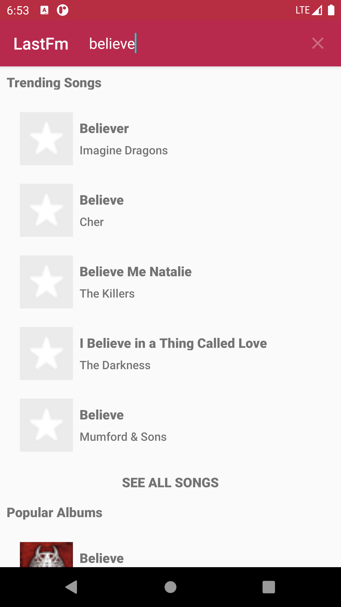
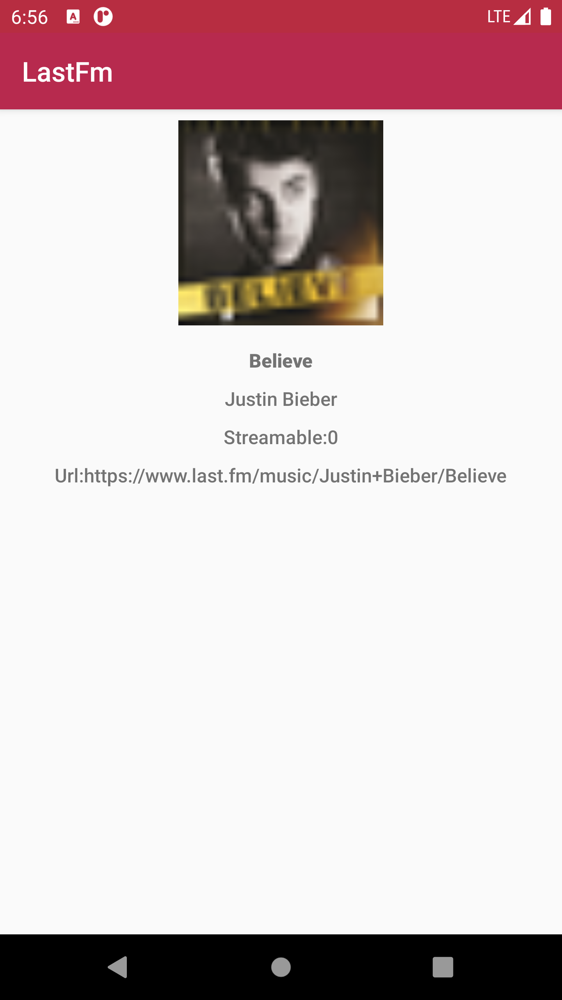

# LastFm

This project is developed as a last.fm search mobile application wherein a user can search for a song, album, artist using a query. This was developed to assess candidate developer’s Android technical proficiency, coding knowledge and style.

## Detailed Specification

1. The user must be able to search {artist, album or songs} API provided here - https://www.last.fm/api/intro for a keyword, with results shown to the user.
2. The user can select an {artist, album or song} to show additional basic details.
3. All the search results {artist, album or songs} are displayed at once to the user with 5 items of each and there are options SEE ALL SONGS, SEE ALL ALBUMS, SEE ALL ARTISTS upon click of which user is redirected to another screen wherein they can view all the respective items.
4. There are error views for server and internet unavailable errors.

## Getting Started

```
git clone https://github.com/NamrataBagerwal/LastFm.git
```

Or the same can be imported directly in Android Studio via VCS -> Git -> Clone.

1. Sign-up for a last.fm account at http://last.fm
2. Go to: https://www.last.fm/api/account/create and create your API Key

## Built With
1. Android Studio 4.0.1
2. Android Kotlin 1.4.0
3. Glide to Lazy Load Images
4. Retrofit for Networking Calls
5. Koin for Dependency Injection
6. Kotlin Coroutines for Thread Management
7. Variety of Test Libraries: Mockito, JUnit, Robolectric, Koin-Test, Kotlin Coroutine Test and their applicable respective Kotlin extensions

## Prerequisite
Device with Android version 6 (v23), Android Studio 4.0.1, Android Kotlin 1.4.0

## Installing
Wait for the project to get build successfully then run the app module on device/emulator.

HomePage with Music Cover will be loaded:


Search Results look like the following image:


Search Result Item Detail View:


Error View loaded in case of Internet Off Connection/Server Unavailability:


Video:


There are some more screenshots in screenshots_videos folder.

## Running the tests
Local Unit test cases for all the Activities except MainActivity, ViewModel, Usecases are up and running. Select each of them/run all the tests at once.

## Known Issues
MainActivity's test cases are failing due to unable to retrieve searchview from Shadow Activity's menu options.

## Future Enhancements
1. Code Optimization and adding Comments.
2. UI Enhancement.
3. Coverage of more unit test cases and applicable instrumentation test cases

## Authors
Namrata Bagerwal

## License
This project is open source and is purely developed as part of Coding Exercise.
